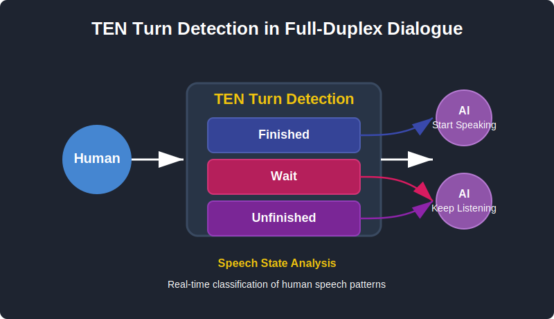

<div align="center">


[](https://github.com/TEN-framework/ten-turn-detection/discussions/)
[](https://github.com/TEN-framework/ten-turn-detection/graphs/commit-activity)
[](https://github.com/TEN-framework/ten-turn-detection/issues)

[](https://github.com/TEN-framework/ten-turn-detection/pulls)
[](https://huggingface.co/TEN-framework/TEN_Turn_Detection)
[](./LICENSE)
[](https://deepwiki.com/TEN-framework/TEN-turn-detection)

</div>

<br>

## Table of Contents

- [Welcome to TEN](#welcome-to-ten)
- [Introduction](#introduction)
- [TEN Hugging Face Space](#ten-hugging-face-space)
- [Key Features](#key-features)
- [Prepared Dataset](#prepared-dataset)
- [Detection Performance](#detection-performance)
- [Quick Start](#quick-start)
  - [Installation](#installation)
  - [Model Weights](#model-weights)
  - [Inference](#inference)
- [Citation](#citation)
- [TEN Ecosystem](#ten-ecosystem)
- [Ask Questions](#ask-questions)
- [License](#license)

<br>

## Welcome to TEN

TEN is an open-source framework for conversational voice AI agents.

[TEN Ecosystem](#ten-ecosystem) includes [TEN Framework](https://github.com/ten-framework/ten-framework), [Agent Examples](https://github.com/TEN-framework/ten-framework/tree/main/ai_agents/agents/examples), [VAD](https://github.com/ten-framework/ten-vad), [Turn Detection](https://github.com/ten-framework/ten-turn-detection) and [Portal](https://github.com/ten-framework/portal).
<br>

| Community Channel | Purpose |
| ---------------- | ------- |
| [](https://twitter.com/intent/follow?screen_name=TenFramework) | Follow TEN Framework on X for updates and announcements |
| [](https://www.linkedin.com/company/ten-framework) | Follow TEN Framework on LinkedIn for updates and announcements |
| [](https://discord.gg/VnPftUzAMJ) | Join our Discord community to connect with developers |
| [](https://huggingface.co/TEN-framework) | Join our Hugging Face community to explore our spaces and models |
| [](https://github.com/TEN-framework/ten-agent/discussions/170) | Join our WeChat group for Chinese community discussions |

<br>

> \[!IMPORTANT]
>
> **Star TEN Repositories** ⭐️
>
> Get instant notifications for new releases and updates. Your support helps us grow and improve TEN!

<br>


<br>

## TEN Hugging Face Space

<https://github.com/user-attachments/assets/725a8318-d679-4b17-b9e4-e3dce999b298>

You are more than welcome to [Visit TEN Hugging Face Space](https://huggingface.co/spaces/TEN-framework/ten-agent-demo) to try VAD and Turn Detection together.

## Introduction

**TEN Turn Detection** is an advanced intelligent turn detection model designed specifically for natural and dynamic communication between humans and AI agents. This technology addresses one of the most challenging aspects of human-AI conversation: detecting natural turn-taking cues and enabling contextually-aware interruptions. TEN Turn Detection incorporates deep semantic understanding of conversation context and linguistic patterns to create more natural dialogue with AI.

<div align="center">
  
</div>

**TEN Turn Detection** categorizes user's text into three key states:

**finished**: A finished utterance where the user has expressed a complete thought and expects a response. Example: "Hey there I was wondering can you help me with my order"

**wait**: An wait utterance where the user has explicitly instructed the AI not to speak. Example: "Shut up"

**unfinished**: A clearly unfinished utterance where the user has momentarily paused but intends to continue speaking. Example: "Hello I have a question about"

These three classification states allow the TEN system to create natural conversation dynamics by intelligently managing turn-taking, reducing awkward interruptions while maintaining conversation flow.

TEN Turn Detection utilizes a multi-layered approach based on the transformer-based language model(Qwen2.5-7B) for semantic analysis.

## Key Features

- **Context-Aware Turn Management**
  TEN Turn Detection analyzes linguistic patterns and semantic context to accurately identify turn completion points. This capability enables intelligent interruption handling, allowing the system to determine when interruptions are contextually appropriate while maintaining natural conversation flow across various dialogue scenarios.

- **Multilingual Turn Detection Support**
  TEN Turn Detection provides comprehensive support for both English and Chinese languages. It is engineered to accurately identify turn-taking cues and completion signals across multilingual conversations.

- **Superior Performance**
  Compared with multiple open-source solutions, TEN achieves superior performance across all metrics on our publicly available test dataset.

## Prepared Dataset

We have open-sourced the TEN-Turn-Detection TestSet, a bilingual (Chinese and English) collection of conversational inputs specifically designed to evaluate turn detection capabilities in AI dialogue systems. The dataset consists of three distinct components:

_wait.txt_: Contains expressions requesting conversation pauses or termination

_unfinished.txt_: Features incomplete dialogue inputs with truncated utterances

_finished.txt_: Provides complete conversational inputs across multiple domains

## Detection Performance

We conducted comprehensive evaluations comparing several open-source models for turn detection using our test dataset:

<div align="center">

| LANGUAGE |         MODEL          | FINISHED<br>ACCURACY | UNFINISHED<br>ACCURACY | WAIT<br>ACCURACY |
| :------: | :--------------------: | :------------------: | :--------------------: | :--------------: |
| English  |        Model A         |        59.74%        |         86.46%         |       N/A        |
| English  |        Model B         |        71.61%        |         96.88%         |       N/A        |
| English  | **TEN Turn Detection** |      **90.64%**      |       **98.44%**       |     **91%**      |

| LANGUAGE |         MODEL          | FINISHED<br>ACCURACY | UNFINISHED<br>ACCURACY | WAIT<br>ACCURACY |
| :------: | :--------------------: | :------------------: | :--------------------: | :--------------: |
| Chinese  |        Model B         |        74.63%        |         88.89%         |       N/A        |
| Chinese  | **TEN Turn Detection** |      **98.90%**      |       **92.74%**       |     **92%**      |

</div>

> **Notes:**
>
> 1. Model A doesn't support Chinese language processing
> 2. Neither Model A nor Model B support the "WAIT" state detection

## Quick Start

### Installation

```
git clone https://github.com/TEN-framework/ten-turn-detection.git
pip install "transformers>=4.45.0"
pip install "torch>=2.0.0"
```

### Model Weights

The TEN Turn Detection model is available on HuggingFace:

- Model Repository: [TEN-framework/TEN_Turn_Detection](https://huggingface.co/TEN-framework/TEN_Turn_Detection)

You can download the model in several ways:

1. **Automatic download** (recommended): The model weights will be automatically downloaded when you run the inference script for the first time. HuggingFace Transformers will cache the model locally.

2. **Using Git LFS**:

   ```bash
   # Install Git LFS if you haven't already
   git lfs install

   # Clone the repository with model weights
   git clone https://huggingface.co/TEN-framework/TEN_Turn_Detection
   ```

3. **Using the Hugging Face Hub library**:

   ```python
   from huggingface_hub import snapshot_download

   snapshot_download(repo_id="TEN-framework/TEN_Turn_Detection")
   ```

### Inference

The inference script accepts command line arguments for user input:

```
# Basic usage
python inference.py --input "Your text to analyze"

```

Example output:

```
Loading model from TEN-framework/TEN_Turn_Detection...
Running inference on: 'Hello I have a question about'

Results:
Input: 'Hello I have a question about'
Turn Detection Result: 'unfinished'
```

## Citation

If you use TEN Turn Detection in your research or applications, please cite:

```
@misc{TEN_Turn_Detection,
author = {TEN Team},
title = {TEN Turn Detection: Turn detection for full-duplex dialogue communication

},
year = {2025},
url = {https://github.com/TEN-framework/ten-turn-detection},
}
```

## TEN Ecosystem

| Project | Preview |
| ------- | ------- |
| [**️TEN Framework**][ten-framework-link]<br>Open-source framework for conversational AI Agents.<br><br>![][ten-framework-shield] | ![][ten-framework-banner] |
| [**TEN VAD**][ten-vad-link]<br>Low-latency, lightweight and high-performance streaming voice activity detector (VAD).<br><br>![][ten-vad-shield] | ![][ten-vad-banner] |
| [**️ TEN Turn Detection**][ten-turn-detection-link]<br>TEN Turn Detection enables full-duplex dialogue communication.<br><br>![][ten-turn-detection-shield] | ![][ten-turn-detection-banner] |
| [**TEN Agent Examples**][ten-agent-example-link]<br>Usecases powered by TEN.<br><br> | ![][ten-agent-example-banner] |
| [**TEN Portal**][ten-portal-link]<br>The official site of the TEN Framework with documentation and a blog.<br><br>![][ten-portal-shield] | ![][ten-portal-banner] |


<br>

## Ask Questions

[](https://deepwiki.com/TEN-framework/TEN-framework)

Most questions can be answered by using DeepWiki, it is fast, intutive to use and supports multiple languages.

<br>

## License

This project is released pursuant to the Apache License, Version 2.0, with additional restrictions.For details, please refer to the[ LICENSE](./LICENSE) file.

[ten-framework-shield]: https://img.shields.io/github/stars/ten-framework/ten_framework?color=ffcb47&labelColor=gray&style=flat-square&logo=github
[ten-framework-banner]: https://github.com/user-attachments/assets/2a560a74-68f3-4f4a-9ec8-89464c42a9c7
[ten-framework-link]: https://github.com/ten-framework/ten_framework

[ten-vad-link]: https://github.com/ten-framework/ten-vad
[ten-vad-shield]: https://img.shields.io/github/stars/ten-framework/ten-vad?color=ffcb47&labelColor=gray&style=flat-square&logo=github
[ten-vad-banner]: https://github.com/user-attachments/assets/e504135e-67fd-4fa1-b0e4-d495358d8aa5

[ten-turn-detection-link]: https://github.com/ten-framework/ten-turn-detection
[ten-turn-detection-shield]: https://img.shields.io/github/stars/ten-framework/ten-turn-detection?color=ffcb47&labelColor=gray&style=flat-square&logo=github
[ten-turn-detection-banner]: https://github.com/user-attachments/assets/c72d82cc-3667-496c-8bd6-3d194a91c452

[ten-agent-example-link]: https://github.com/TEN-framework/ten-framework/tree/main/ai_agents/agents/examples
[ten-agent-example-banner]:https://github.com/user-attachments/assets/7f735633-c7f6-4432-b6b4-d2a2977ca588

[ten-portal-link]: https://github.com/ten-framework/portal
[ten-portal-shield]: https://img.shields.io/github/stars/ten-framework/portal?color=ffcb47&labelColor=gray&style=flat-square&logo=github
[ten-portal-banner]: https://github.com/user-attachments/assets/f56c75b9-722c-4156-902d-ae98ce2b3b5e
